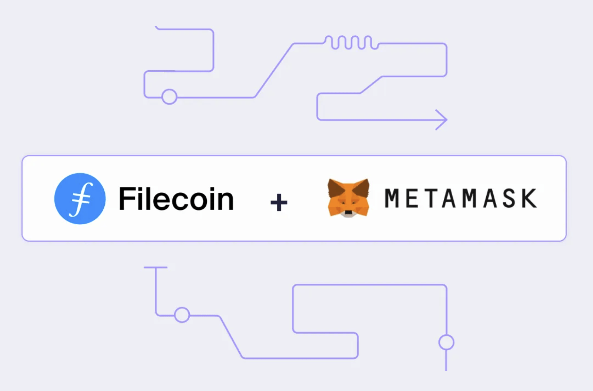
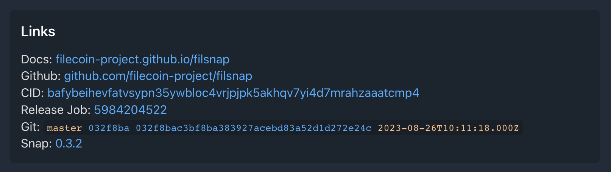

Many crypto wallets are out on the market, but they don't all have the same capabilities. They may be specific to a particular ecosystem or lack dapp functionality. But what if there were a way to expand a wallet's abilities to surpass these limitations?

The Filecoin network has only a few native wallet clients. How can we increase the adoption of the Filecoin network so developers and users can access the ecosystem while also integrating the benefits of the EVM? [Metamask's Snaps](https://metamask.io/snaps/) are one way to add custom functionality to a widely used wallet.

### **Understanding Filecoin Wallet Addresses**

First, for clarity, let's review some [wallet terminology](https://fission.codes/blog/wallet-stack/). Wallets can contain multiple accounts. Each account has an address. Think of it like a bank account with a checking account number.

Getting more technical, wallets have Secret Recovery Phrases. Accounts are derived from SRPs, creating private keys that control the account. Addresses are public and are tied to the transactions executed over the blockchain.

Filecoin has five types of addresses. The ones we'll focus on are F1 and F4. F1 is the Filecoin native address for transactions done solely over the Filecoin network. F4 is the FEVM address. FEVM, or the Filecoin Ethereum Virtual Machine, allows developers to port any existing EVM-based smart contracts straight onto the FVM. The F4 address is a translation layer to the EVM ecosystem.

### **Introducing Filsnap**

Filsnap is a MetaMask plugin, or [snap](https://metamask.io/snaps/), that adds support for Filecoin native accounts and functionality. MetaMask only supports the EVM ecosystem, so Fission's plugin enables users to utilize MetaMask as a Filecoin wallet.

Filecoin native wallet: Filsnap can send transactions and receive assets using F1 addresses.

F1 to F4: Say a person has a wallet supporting only Filecoin native F1 addresses. The user could send their assets to Filsnap and, from there, send assets to F4 addresses. The same goes for exchanges like Coinbase, which doesn't support F4 addresses yet.

F4 to F1: Say a user wants to withdraw yield from a liquidity pool and put it in cold storage. They can send assets from an F4 address in the Filsnap wallet to the cold wallet that supports F1 addresses via a FilForwarder smart contract. This contract translates from FEVM to native.

### **The Filsnap Library**

Although Filecoin JS libraries were already available, we chose not to reuse them for a few reasons. First, MetaMask is constantly changing, and we wanted to ensure the code was as up-to-date as possible. Second, the existing libraries are big and weighed down by many dependencies. A lightweight wallet client is preferred for a better user experience when working with the blockchain. Third, because we take security so seriously, we had all of the cryptography dependencies in our library independently audited for peace of mind.

The new [Filecoin JavaScript Library - iso-filecoin](https://github.com/hugomrdias/iso-repo/tree/main/packages/iso-filecoin) is the foundation for three packages - Filsnap, Filsnap Adapter, and Filsnap Adapter React. [Filsnap](https://github.com/filecoin-project/filsnap/tree/master/packages/snap) is the snap installed in the MetaMask extension. [Filsnap Adapter](https://github.com/filecoin-project/filsnap/tree/master/packages/adapter) enables developers to interact with Filsnap from a dapp. Finally, [Filsnap Adapter React](https://github.com/filecoin-project/filsnap/tree/master/packages/adapter-react) includes React-specific hooks for dapp integration.

As mentioned, there are few native Filecoin wallets, and the existing ones don't expose their functionality to dapps. Filsnap, however, has an API for transactions on the native layer, enabling developers to build apps with native Filecoin functionality!

### **The Filsnap Demo**

The Filsnap demo supports Filecoin native and FEVM transactions using either Filsnap for native or Metamask for EVM. As mentioned above, it's a great way to manage your assets despite the current technical limitations in wallets and exchanges. [It used to be much more complicated](https://filecointldr.io/article/guide-how-to-transfer-fil-from-coinbase-to-a-metamask-wallet-0x), but now you can do it all in the Filsnap demo app.

Another benefit of using the Filsnap demo app is security through verifiability. Anyone can verify the snap installed in Metamask through [NPM Provenance](https://www.npmjs.com/package/filsnap/v/0.3.2#user-content-provenance) and the app code using [IPFS](https://bafybeihevfatvsypn35ywbloc4vrjpjpk5akhqv7yi4d7mrahzaaatcmp4.ipfs.dweb.link/) and [GitHub](https://github.com/filecoin-project/filsnap/actions/runs/5984204522/attempts/1#summary-16235152758).

:::image-figure[App integrity using content addressing.]

:::

Every app release and git tag is published to IPFS using [Fission apps](https://guide.fission.codes/developers/cli/working-with-apps) and can be cloned/forked from [GitHub](https://github.com/filecoin-project/filsnap) if a user wishes to self-host or verify integrity using content addressing.

### **Getting Started**

The Filsnap package has been audited, and the [MetaMask Snaps are now in open beta](https://metamask.io/snaps/).

The Fission team, lead by Hugo Dias, implemented the audited Filsnap as part of a contract with Protocol Labs. As part of this process, Hugo also wrote and open sourced the isomorphic filecoin utilities, which is now the recommended way to work with native Filecoin accounts and supporting cryptography.

- Isomorphic Filecoin abstractions for RPC, signatures, address, token and wallet. [`iso-filecoin`](https://github.com/fission-codes/filecoin)
- [API Docs](https://fission-codes.github.io/filecoin)
- [NPM package](https://www.npmjs.com/package/iso-filecoin)

Please get in touch if you'd like to support long term maintenance of core open source Filecoin utilities.

Try the [Filsnap demo](https://filsnap.fission.app/) today, and let us know what you think! We'd love to hear your feedback. Join us in the `#filsnap` channel in Filecoin Slack, or drop by the [Fission Discord](https://fission.codes/discord).
