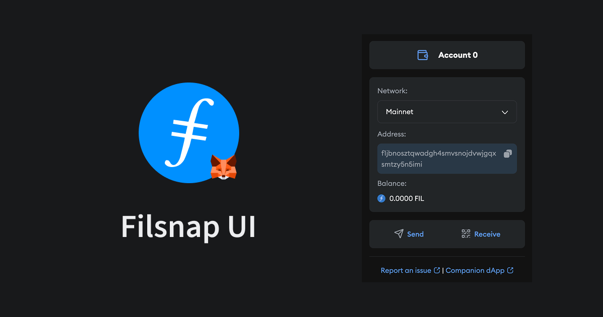

The landscape of web3 interaction is evolving, and with the latest updates to the Metamask Extension and Filsnap, managing your Filecoin assets and understanding your transactions is becoming more intuitive than ever. Imagine a world where you can effortlessly handle your accounts directly within your familiar Metamask interface, without the need to jump between separate applications. That vision is now a reality.

<figure class="Lightbox">

<figcaption>
  Filsnap UI
</figcaption>
</figure>

The Metamask Extension has been enhanced with a brand-new interactive UI, placing you firmly in control of your accounts. This update introduces a dedicated snap Homepage, your central hub for managing funds, sending transactions, and receiving assets – all within the extension itself. The experience is now more cohesive, with all connection and signature request dialogs adhering to the same thoughtful design principles established in this new homepage. Under the hood, these improvements are powered by the robust JSX components from the snaps SDK, ensuring a smooth and integrated user journey.

<figure class="Lightbox" style="margin: 20px auto; max-width: 200px;">

<figcaption>
  Filsnap Homepage
</figcaption>
</figure>

## Transaction & Signature Insights
Beyond streamlined account management, Filsnap is also taking significant strides in providing users with greater transparency. The platform now boasts support for multiple insights, shedding light on both your transactions and signature requests. But the journey doesn't end there. The team is actively seeking collaborations with other projects to enrich these insights with even more Filecoin-specific details. If you're involved in building with smart contracts, crafting custom signatures, or developing unique transaction flows, your input is invaluable! Join the discussion on [Github](https://github.com/filecoin-project/filsnap/discussions/338) and help shape the future of transaction understanding. For those eager to delve deeper, the Metamask documentation offers comprehensive resources on [Transaction Insights](https://docs.metamask.io/snaps/features/transaction-insights/) and [Signature Insights](https://docs.metamask.io/snaps/features/signature-insights/).

<figure class="Lightbox" style="margin: 20px auto; max-width: 200px;">

<figcaption>
    Transaction Insights for FilForwarder calls
</figcaption>
</figure>

## New filsnap.dev

The companion dapp, [filsnap.dev](https://filsnap.dev), has also undergone a remarkable transformation, rebuilt from the ground up with the cutting-edge iso-filecoin React integration and Wallet Adapters. This revamp not only incorporates all the latest FilSnap functionalities but also expands wallet compatibility. Now, in addition to supporting Filsnap itself, you can seamlessly integrate Ledger Filecoin wallets and even utilize an in-browser Burner wallet, offering unprecedented flexibility in how you manage your Filecoin. Furthermore, support for the FEVM wallet and the process of forwarding funds between FEVM and Filecoin has been refined, ensuring a smoother and more reliable experience.

<figure class="Lightbox">

<figcaption>
    filsnap.dev
</figcaption>
</figure>

## Updates and Improvements

For developers looking to leverage these advancements, a suite of new RPC methods has been introduced:

- `fil_getConfig` and `fil_setConfig`: Offer enhanced control over origin configurations.
- `fil_getAccount`: Provides improved handling of account data, aligning perfectly with iso-filecoin types.
- `fil_sign`: Empowers you to sign arbitrary bytes.
- `fil_deriveAccount`: Allows for deriving accounts based on a provided address index.
- `fil_changeNetwork`: Simplifies the process of switching between active networks and deriving corresponding accounts.

Beyond these major updates, several smaller yet significant improvements have been implemented:

- React context provider now supports reconnect on mount and syncing with the Metamask provider.
- Private Key export now displays the Filecoin Lotus hex encoded key.
- A new `insights-wagmi` example demonstrates how to utilize the `filsnap-adapter` to enable transaction insights for smart contract calls within a Wagmi environment.

These updates represent a significant step forward in making the Filecoin ecosystem more accessible and user-friendly within the Metamask environment. Explore the possibilities and dive deeper into the documentation and code:

- [Github Repo](https://github.com/filecoin-project/filsnap)
- [Documentation](https://filecoin-project.github.io/filsnap)
- [filsnap.dev](https://filsnap.dev)