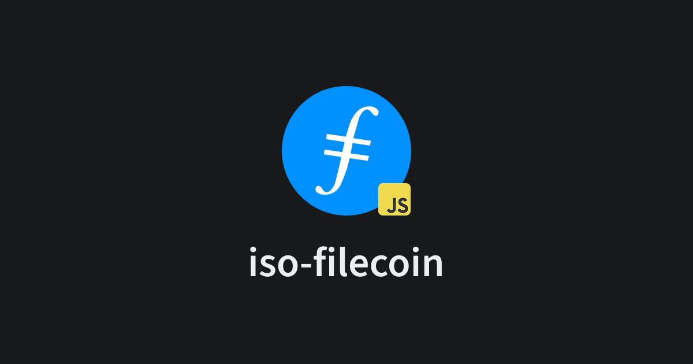

We're thrilled to announce a significant update to the `iso-filecoin` Javascript package, bringing a host of new features and improvements designed to enhance your Filecoin development experience. This release focuses on providing better wallet support, streamlined React integration, and increased flexibility. Let's dive into the key highlights:

### Enhanced Wallet Support with Ledger Integration

A major addition is the introduction of Ledger support! You can now seamlessly integrate the Filecoin Ledger app into your applications. For more detailed information, refer to the client [documentation](https://filecoin.hugomrdias.dev/packages/core/#ledger).

### Streamlined React Integration

For React developers, we've introduced the `FilecoinProvider` component. This component simplifies the process of initializing the necessary context, making wallet state and helpful hooks readily available throughout your application.

The React integration uses `@tanstack/react-query` for data fetching and mutations, making data fetching and management within your Filecoin applications more efficient. The following hooks are now available:

- `useAccount`
- `useAddresses`
- `useBalance`
- `useDeriveAccount`
- `useDisconnect`
- `useEstimateGas`
- `useSendMessage`
- `useSign`

Explore the React integration [documentation](https://filecoin.hugomrdias.dev/packages/react/) for further details.

### Introducing Unified Wallet Adapters

We've implemented a new unified interface for Filecoin wallets, providing a more consistent and intuitive way to interact with different wallet solutions. This release includes four new implementations:

- Filsnap (Filecoin Metamask Wallet)
- Ledger FilecoinWallet
- In-memory Hierarchical Deterministic (HD) Wallet
- In-memory Private Key wallet

You can find more information about these adapters in the [documentation](https://filecoin.hugomrdias.dev/packages/adapters/).

### New Documentation Website

To provide a better learning experience, we've launched a brand new documentation website: [filecoin.hugomrdias.dev](https://filecoin.hugomrdias.dev). This site will serve as the central hub for all `iso-filecoin` related documentation.

### Miscellaneous Improvements

This release also includes several other notable improvements:

- **Protection against sending funds to 0x ID masked addresses:** This adds an extra layer of security to prevent accidental transfers.
- **Utilizing InvokeEVM for direct sends to 0x addresses:** The package now uses `InvokeEVM` method for safer transactions to 0x addresses.
- **Contract definitions are now exported from the package:** This makes it easier to work with Filecoin smart contracts within your applications.
- **New Chain definitions:** The package now includes the latest chain definitions for Filecoin.

We encourage you to explore these new features and improvements in the latest version of `iso-filecoin`. As always, refer to the updated documentation for detailed guides and examples.