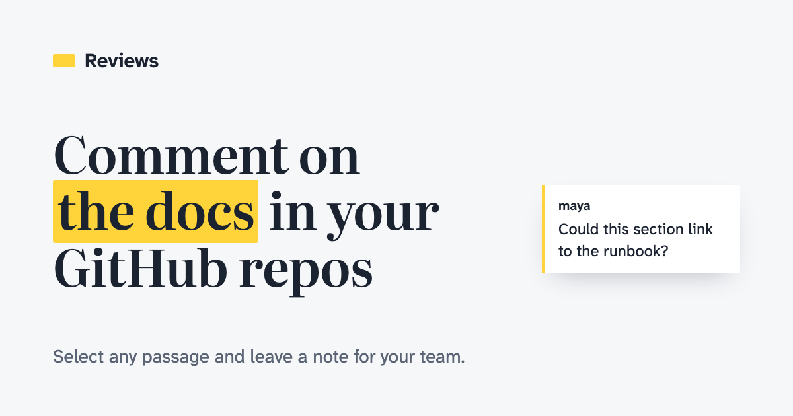

A lot of the writing that matters lives in markdown inside a repository: design docs, RFCs, runbooks, READMEs and, more and more, the instructions we hand to coding agents. GitHub renders those files nicely, but it has no good way to talk about them. You can comment on a pull request diff, and that thread disappears from view once the pull request merges. You can't select a paragraph in a merged doc and say "this is wrong" or "could this link to the runbook?"

So I built [Reviews](https://reviews.hugodias.me). It shows a repository's markdown the way GitHub renders it, and lets you select any passage and leave a comment for your team. The comments live in the app's database, never in the repository, so there are no extra commits and no files to keep in sync.

## Access follows GitHub

You sign in with GitHub, and the app installs as a GitHub App with read-only access to contents and metadata. You can see a repository and its comments when your GitHub account can read it and the owner has installed the app on it. This holds for public repositories too: being able to read one on GitHub isn't enough to see its comments here.

What you can do with comments follows your role on the repository:

| Role            | Read comments | Comment, reply, edit or delete your own | Resolve or reopen threads |
| --------------- | ------------- | --------------------------------------- | ------------------------- |
| Read, Triage    | Yes           | No                                      | No                        |
| Write           | Yes           | Yes                                     | Your own threads          |
| Maintain, Admin | Yes           | Yes                                     | Any thread                |

Relative links between files open inside Reviews instead of github.com, and images in private repositories load through the app, so a set of linked docs reads like a small site.

## Comments survive edits

The hard part of commenting on living documents is that they keep changing. A comment pinned to "line 42" is wrong after the next commit.

Reviews remembers the quoted text and its surroundings for each comment. When the file changes, the comment follows the text. If the text was reworded, the comment is marked as edited. If it was removed, the comment is marked as outdated, and you can still open the file as it was or see what changed. Every read is pinned to the commit the branch resolves to, so you never see a comment placed on a version of the file that isn't on screen.

Each file has three views:

- **Page** shows the rendered markdown with notes in the margin.
- **Source** shows the raw file, where you comment on lines.
- **Changes** shows a diff between two commits, with comments on both sides.

## Agents work through comments

This is the part I use most. When an agent writes or edits the docs, the review loop usually means copying comments into a chat by hand. Reviews has an MCP server, so a coding agent can read the threads on a repository, change the files, reply, and mark each thread _addressed_ with the commit that fixed it.

The agent acts as the person who connected it, with their GitHub access, so it sees what they see and nothing more. Its comments carry its name, like "Claude Code". Agents can't resolve threads: a person confirms the fix or reopens the thread. That keeps a human in charge of what counts as done.

The MCP server exposes four tools:

- `list_threads` and `get_thread` show the threads placed on a commit, with their current lines.
- `reply` comments on a thread.
- `mark_addressed` replies and marks a thread addressed, with the commit that fixed it.

There's also an `address_comments` prompt that lists a repository's open threads along with the working rules.

The easiest way to connect is the Reviews plugin, which bundles the MCP connection with skills for checking and addressing comments in Claude Code and Codex. In Claude Code:

```bash
claude plugin marketplace add hugomrdias/reviews --sparse .claude-plugin plugins
claude plugin install reviews@reviews
```

Or add just the MCP server, from the repository you're working on:

```bash
claude mcp add --transport http reviews https://reviews.hugodias.me/mcp
```

Either way, sign in from `/mcp`. A browser opens, you approve the connection in Reviews, and GitHub signs you in. From then on, asking the agent to address the comments on the repo is enough.

You don't need to install anything first, either. Tell the agent to "use reviews.hugodias.me to address the comments on this repo" and it reads the site's guide at `/llms.txt`, which explains how to connect and what to do. And if you'd rather not connect an agent at all, _Copy for agent_ copies a file's open threads as one prompt you can paste anywhere.

## How it's built

Reviews is a single Cloudflare Worker running [TanStack Start](https://tanstack.com/start) and React, with comments in D1 and agent connections in KV. The file tree uses [@pierre/trees](https://trees.software), code, source and diffs use [@pierre/diffs](https://diffs.com), and the UI uses shadcn/ui. The comment-anchoring code runs both in the browser and on the Worker, so the server can place comments on the rendered page's text without a browser.

Agents sign in with OAuth 2.1, with Reviews as the authorization server and GitHub as the identity step behind it, built on Cloudflare's `workers-oauth-provider`. Each agent connection gets its own GitHub token pair, so an agent and your browser session never fight over the same refresh token.

## Try it

- [reviews.hugodias.me](https://reviews.hugodias.me)
- [Source on GitHub](https://github.com/hugomrdias/reviews)

The repository's README covers running it locally and deploying your own copy to Cloudflare. Install the app on a repository with some docs, leave a few comments, and point an agent at them.
