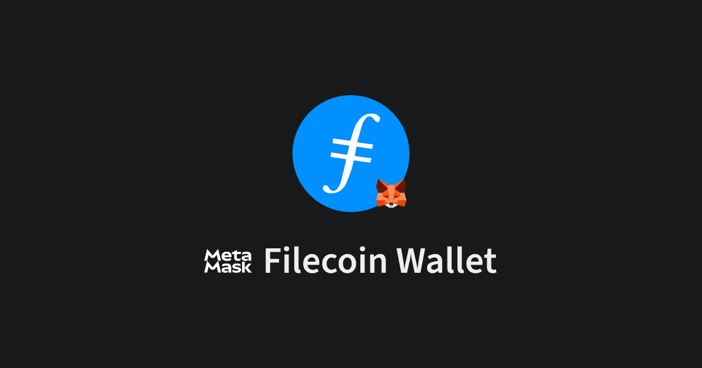
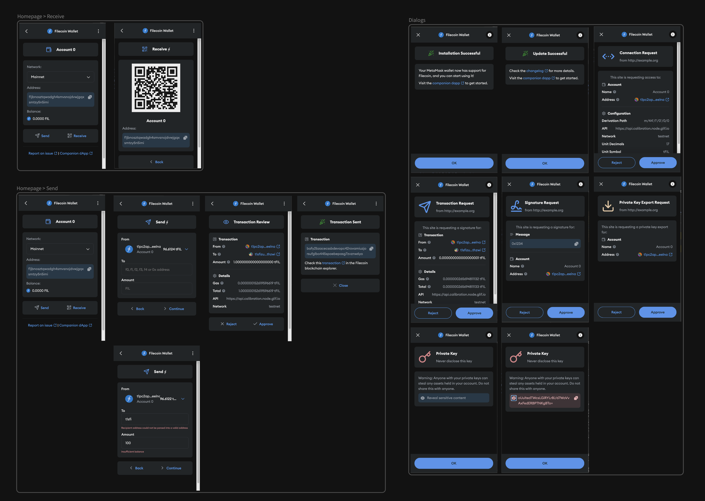

:::image-figure[Connect to Filecoin dapps using Metamask.]

:::

> Connect to Filecoin dapps using Metamask. Manage Filecoin accounts, send FIL to Native and FEVM accounts and enable FEVM transaction insights.

Filecoin Metamask Snap and related packages enable developers to add Filecoin integration to their dapps.

This Snap enables storage of native Filecoin private keys in Metamask's local vault, to support native Filecoin addresses (e.g. f1 addresses or t1 testnet addresses).

For FEVM (Filecoin EVM) address support using Ethereum-style 0x addresses, you can also use regular Metamask directly **without** installing this Snap.

If you're using FEVM, the Snap can also show your 0x address info and its equivalent Filecoin f410 address. (More info about 0x / f410 addresses can be found in the [Filecoin Docs - Ethereum Address Manager](https://docs.filecoin.io/smart-contracts/filecoin-evm-runtime/address-types#ethereum-address-manager).)

:::image-figure[Filecoin Metamask Snap UI.]

:::

## Resources

- [Filecoin MetaMask Snap Wallet Demo](https://filsnap.dev)
- [Filecoin Metamask Snap Docs](https://filecoin-project.github.io/filsnap/)

## Packages

- [filsnap](https://github.com/filecoin-project/filsnap/tree/master/packages/snap) - Filecoin snap for Metamask
- [filsnap-adapter](https://github.com/filecoin-project/filsnap/tree/master/packages/adapter) - Adapter to interact with Filsnap from a dapp
- [filsnap-adapter-react](https://github.com/filecoin-project/filsnap/tree/master/packages/adapter-react) - React hooks to interact with Filsnap from a dapp

## Examples

- [`demo`](https://github.com/filecoin-project/filsnap/tree/master/examples/demo) - Preact demo dapp using [filsnap-adapter](<[./packages/adapter](https://github.com/filecoin-project/filsnap/tree/master/packages/adapter)>) to interact with [filsnap](<[./packages/snap](https://github.com/filecoin-project/filsnap/tree/master/packages/snap)>)
- [`fil-forwarder-viem`](https://github.com/filecoin-project/filsnap/tree/master/examples/fil-forwarder-viem) - [Viem](https://viem.sh/) example to send FIL using FilForwarder contract.
- [Fund Ring](https://github.com/FundRing/fundring/tree/main/src/routes/filfund) - Svelte dapp [dapp](https://fundring.fission.app/) that using filsnap to fund projects with Filecoin.

## Usage

You can install and use filsnap using the Metamask provider.

```ts twoslash
import { FilsnapAdapter, getProvider } from 'filsnap-adapter'

const provider = await getProvider()
const snap = await FilsnapAdapter.connect({ provider, snapId: 'npm:filsnap', config: { network: 'testnet' } })

const { error, result } = await snap.getAddress()
if (error) {
  console.error(error)
} else {
  console.log(result)
  // t1d2xrzcslx7xlbbylc5c3d5lvandqw4iwl6epxba
}
```

We recommend using [`filsnap-adapter`](https://github.com/filecoin-project/filsnap/tree/master/packages/adapter) to interact with filsnap for a simpler interface. Check the full API [documentation](https://filecoin-project.github.io/filsnap/).

## Security Audits

**Filsnap v1.0.1** - The FilSnap v0.5.0 was audited by [ConsenSys Diligence](https://consensys.io/diligence/) in August 2023 with a follow-up assessment of fixes conducted in October 2023, leading to the release of [filsnap-v1.0.1](https://github.com/filecoin-project/filsnap/releases/tag/filsnap-v1.0.1). The complete audit report is [available here](https://github.com/filecoin-project/filsnap/tree/master/audits/filsnap-audit-2023-08.pdf) in the `audits/` directory as well as on the [ConsenSys Diligence website](https://consensys.io/diligence/audits/2023/08/metamask/partner-snaps-filsnap/).
