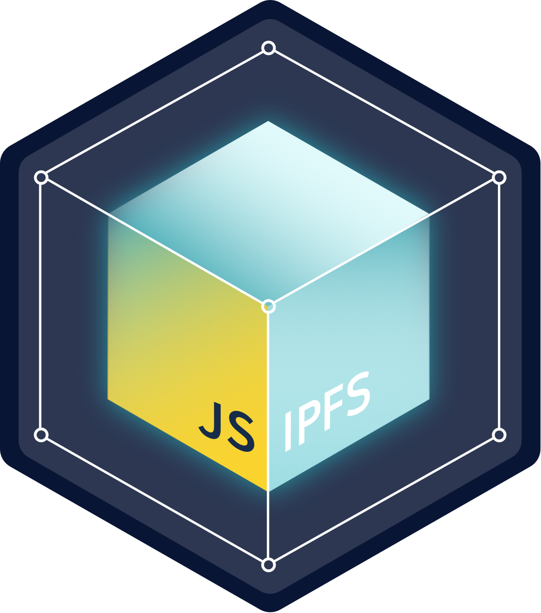

:::image-div{class="image-hero"}

:::

The InterPlanetary File System (IPFS) is a set of composable, peer-to-peer protocols for addressing, routing, and transferring content-addressed data in a decentralized file system.

**Getting started**

- Read the [docs](https://github.com/ipfs/js-ipfs/tree/master/docs)
- Ensure CORS is [correctly configured](https://github.com/ipfs/js-ipfs/blob/master/docs/CORS.md) for use with the HTTP client
- Look into the [examples](https://github.com/ipfs-examples/js-ipfs-examples/tree/master) to learn how to spawn an IPFS node in Node.js and in the Browser
- Consult the [Core API docs](https://github.com/ipfs/js-ipfs/tree/master/docs/core-api) to see what you can do with an IPFS node
- Head over to [https://proto.school](https://proto.school/) to take the [IPFS course](https://proto.school/course/ipfs) that covers core IPFS concepts and JS APIs
- Check out [https://docs.ipfs.io](https://docs.ipfs.io/) for [glossary](https://docs.ipfs.io/concepts/glossary), tips, how-tos and more
- Need help? Please ask 'How do I?' questions on [https://discuss.ipfs.io](https://discuss.ipfs.io/)
- Find out about chat channels, the IPFS newsletter, the IPFS blog, and more in the [IPFS community space](https://docs.ipfs.io/community/).
