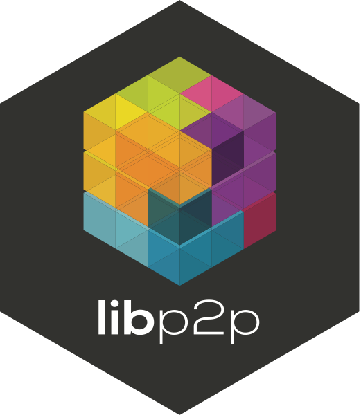

:::image-div{class="image-hero"}

:::

libp2p is the product of a long and arduous quest to understand the evolution of the Internet networking stack. In order to build P2P applications, devs have long had to make custom ad-hoc solutions to fit their needs, sometimes making some hard assumptions about their runtimes and the state of the network at the time of their development. Today, looking back more than 20 years, we see a clear pattern in the types of mechanisms built around the Internet Protocol, IP, which can be found throughout many layers of the OSI layer system, libp2p distils these mechanisms into flat categories and defines clear interfaces that once exposed, enable other protocols and applications to use and swap them, enabling upgradability and adaptability for the runtime, without breaking the API.

We are in the process of writing better documentation, blog posts, tutorials and a formal specification. Today you can find:

- [libp2p.io](https://libp2p.io/)
- [docs.libp2p.io](https://docs.libp2p.io/)
- [Specification (WIP)](https://github.com/libp2p/specs)
- [Discussion Forums](https://discuss.libp2p.io/)
- Talks
  - [`libp2p <3 ethereum` at DEVCON2](https://archive.devcon.org/archive/watch/2/libp2p-devp2p-ipfs-and-ethereum-networking/)
- Articles
  - [The overview of libp2p](https://github.com/libp2p/libp2p#description)

To sum up, libp2p is a "network stack" -- a protocol suite -- that cleanly separates concerns, and enables sophisticated applications to only use the protocols they absolutely need, without giving up interoperability and upgradability. libp2p grew out of IPFS, but it is built so that lots of people can use it, for lots of different projects.
