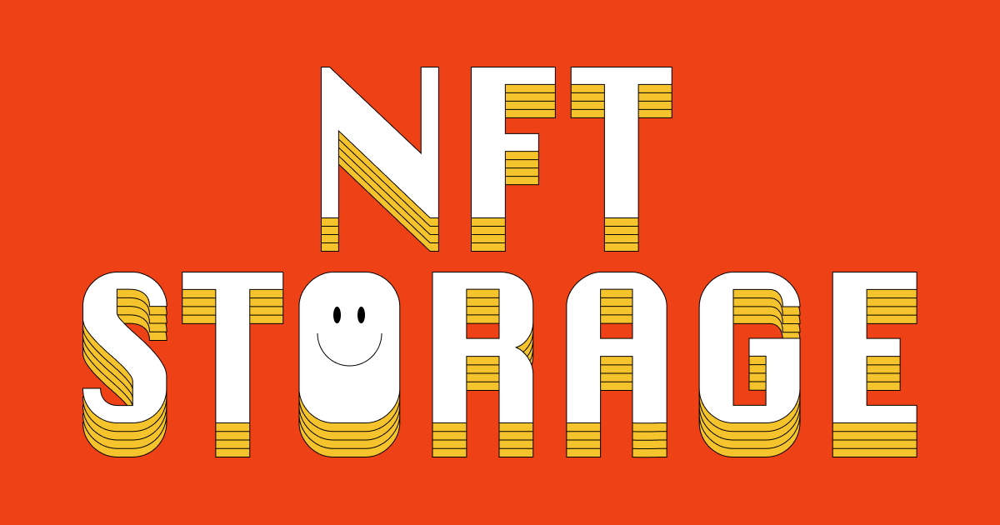

:::image-figure[NFT Storage logo.]

:::

Secure your NFT collections
Easily back up your digital assets with our cost-effective solution.

Experience verifiable, long-term storage for offchain data powered by smart contracts and supported by an onchain endowment—aiming to ensure security, transparency, and peace of mind.
